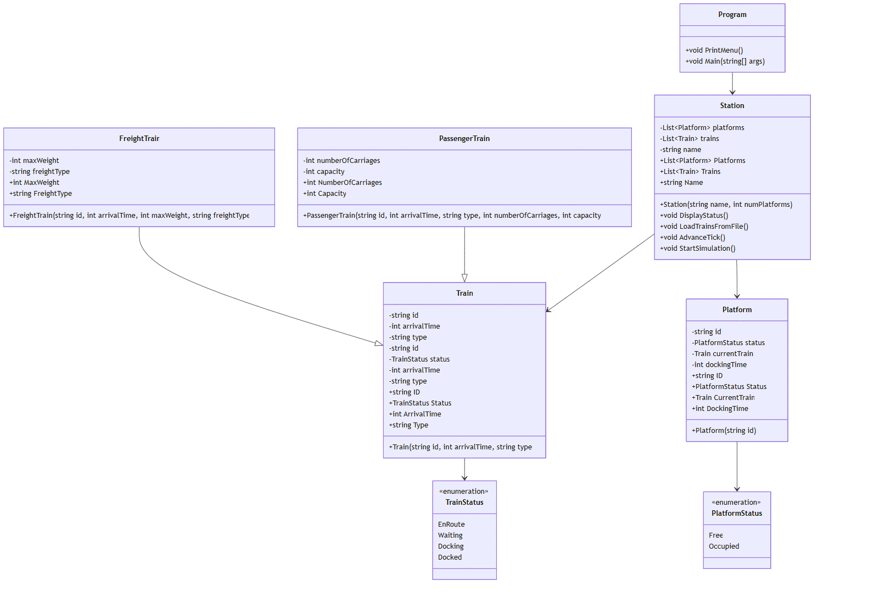

# oop_pw1_ext_2425

## Design Detailed Document

### Table of Contents
- [Introduction](#Introduction)
- [Description](#Description)
- [Problems](#Problems)
- [Conclusions](#Conclusion)

### Introduction

This program simulates the operation of a train station, managing the arrival and docking of different trains. It uses object-oriented programming concepts, such as encapsulation, inheritance, abstraction and polymorphism in C#.

### Description

#### Class Diagram

This class diagram shows all the classes and methods used for the train station.

#### Train
The Train class has an ID, an arrival time, the type (Passenger or freight), and an enum representing the train's status (EnRoute, Waiting, Docking and Docked). This class does not define any methods.

#### Freight Train
The FreightTrain class is derived from Train, and adds two specific attributes, the maximum weight and the freight type. This class does not define any methods.

#### Passenger Train
The PassengerTrain class is derived from Train, and also adds two specific attributes, the number of carriages and the capacity. This class does not define any methods.

#### Platform
The Platform Class has an enum status (Free or occupied), an ID, a docking time, and a declaration of Train used for the operations (currentTrain). This class does not define any methods.

#### Station
The Station class coordinates all operational logic, including train management and platform assignment. First, it creates a list of trains and platforms, and a name for the station.

The DisplayStatus method shows the information of every train, its ID, status and arrival time. It also shows information about the platform, whether it is free or occupied, and what train occupies it. This is made using two foreach loops.

The LoadTrainsFromFile method first asks for the name of the CSV file, then, using streamreader, adds every train to the list, and differentiates if it is a passenger or a freight train.

The AdvanceTick method reduces the arrival time of each train by 15 minutes. Then, if a train is waiting to be docked, it will search for a free platform. When a train is successfully docked after 2 ticks, it will free the platform and change the train status to docked.

The StartSimulation method starts AdvanceTick and DisplayStatus. This method ends when it detects that all trains are docked.

#### Program

The program class first asks the user for the number of platforms to create. Then, it prints a menu using the PrintMenu method. The user can choose between loading trains from a CSV file, Starting the simulation or exiting the program.

### Problems
During this project, I encountered multiple problems to which it was difficult to find a solution.

First, I had a problem where the DisplayStatus method would work correctly, but it did not clean the console, the program erased part of it, but there was overlapping text that was duplicated. I tried using ConsoleClear on other parts of the program, like on the AdvanceTick method or even on the Program class. However, I could not find a solution, sometimes it worked correctly while other times it would duplicate the text.

Another problem I had was making the AdvanceTick method work properly, as I had to try many times to make it work. For example, it took me a long time to realize I could use a boolean variable (platformAssigned) to make it easier.

### Conclusion
Through the development of this project, I reinforced my understanding of object-oriented programming concepts like inheritance and encapsulation in a practical context. I learned the importance of organizing code clearly and testing thoroughly, especially when dealing with time-based operations and visual output. While some issues, like the console not clearing properly, remained partially unresolved, the overall solution proved effective for simulating a basic train station. These insights will be useful for improving future projects in terms of structure and debugging strategies.